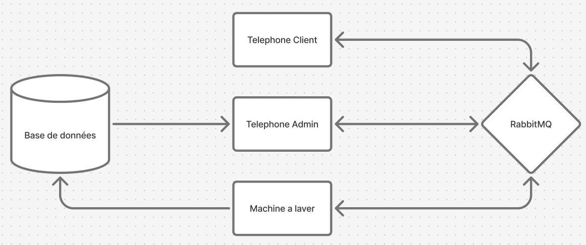

# Simulateur de laverie

Ce projet simule le fonctionnement d'une laverie connectée en utilisant une architecture micro-services conteneurisée. Chaque élément de la laverie (machines, clients, admin) est isolé dans un conteneur Docker et communique via un broker de messages et une base de données aux autres machines.

---

## Architecture du Système

### Les composants

* **Machines à Laver  :**
    * Simulent des cycles de lavage réels (Coton, Rapide, Intensif, Laine, etc.).
    * Publient leur consommation (eau/électricité) et leur progression en temps réel sur **RabbitMQ**.
    * Enregistrent l'historique final de chaque cycle dans **PostgreSQL**.
* **Téléphone Administrateur :**
    * **Contrôle Total :** Envoie des commandes (`ON`, `OFF`, `PAUSE`) à n'importe quelle machine via des échanges de type `topic`.
    * **Monitoring :** Récupère l'historique complet et les logs de maintenance directement depuis la base de données.
* **Téléphone Client :**
    * **Interaction Simplifiée :** Peut réserver et lancer une machine spécifique.
    * **Suivi en Direct :** Reçoit des notifications de progression via une file d'attente dédiée.

---

## Stack Technique

* **Langage :** Java 17+ (Gestion via Maven)
* **Messaging :** RabbitMQ (Échanges de type `topic` pour un routage flexible)
* **Base de données :** PostgreSQL 16 (Persistance de l'historique et des logs)
* **Conteneurisation :** Docker & Docker Compose (Orchestration complète)

---

## Installation et Lancement

### 1. Prérequis
* Docker et maven installés.
* Un fichier `.env` à la racine contenant les identifiants (DB, RabbitMQ, IDs des machines).

### 2. Déploiement
Lancez l'infrastructure complète avec deux commandes :
```bash
mvn clean package
docker compose up --build -d
```